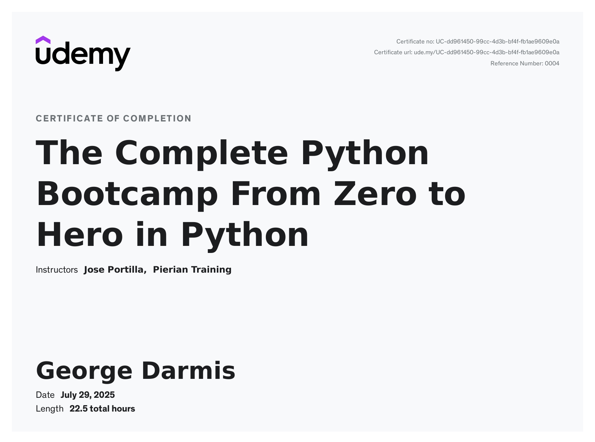
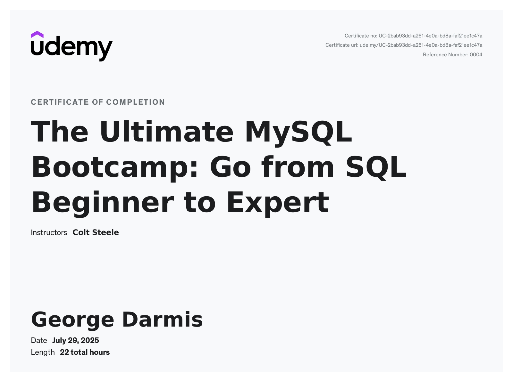

# 🎓 Udemy Course Certificates

This repository contains certificates for courses I’ve completed on Udemy, demonstrating my learning and skills in Python programming and SQL database management.

---

## 🐍 The Complete Python Bootcamp: From Zero to Hero in Python

**Instructor:** Jose Portilla  
**Platform:** Udemy  
**Status:** ✅ Completed

### 📜 Certificate

  
> Completed on April 2025

### 🧠 Topics Covered

- Python 3 fundamentals
- Variables and data types
- Loops and conditionals
- Functions and lambda expressions
- Object-Oriented Programming (OOP)
- Error handling
- Modules and packages
- File I/O
- Web scraping
- APIs
- Decorators & Generators
- Unit Testing
- Jupyter Notebook

🔗 [View Course on Udemy](https://www.udemy.com/course/complete-python-bootcamp/)

---

## 🛢️ The Ultimate MySQL Bootcamp: Go from SQL Beginner to Expert

**Instructors:** Colt Steele & Ian Schoonover  
**Platform:** Udemy  
**Status:** ✅ Completed

### 📜 Certificate

  
> Completed on November 2024

### 🧠 Topics Covered

- SQL syntax & MySQL installation
- Database design & normalization
- Creating and altering tables
- CRUD operations
- Joins (INNER, LEFT, RIGHT)
- Aggregation (GROUP BY, HAVING)
- Subqueries
- Window functions
- Triggers, views, stored procedures
- Security & user privileges

🔗 [View Course on Udemy](https://www.udemy.com/course/the-ultimate-mysql-bootcamp-go-from-sql-beginner-to-expert/)

---

## 📂 Repository Structure

